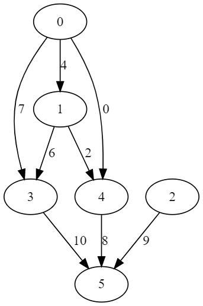
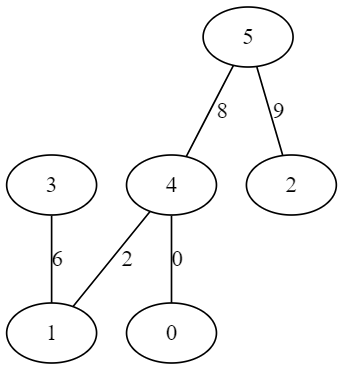

# Kruskal

You can compile the project with something as simple as 

```
g++ kruskal.cpp
```

Examples show how to use this visualization. First you build a graph. Then (if you need a visual representation of it) you call the *displayGraph* function. You call kruskal's algorithm with additional filepath - there we will be saving our union find states.

We represent the MST as a graph, so we can reuse out *displayGraph* function.

So after all we have 3 files - the graph, the union find states and the mst.

They are exported to DOT format. Open source parser can be found [at this link](https://dreampuf.github.io/GraphvizOnline/).

## Example 2 output
---

### Graph


---

### MST
