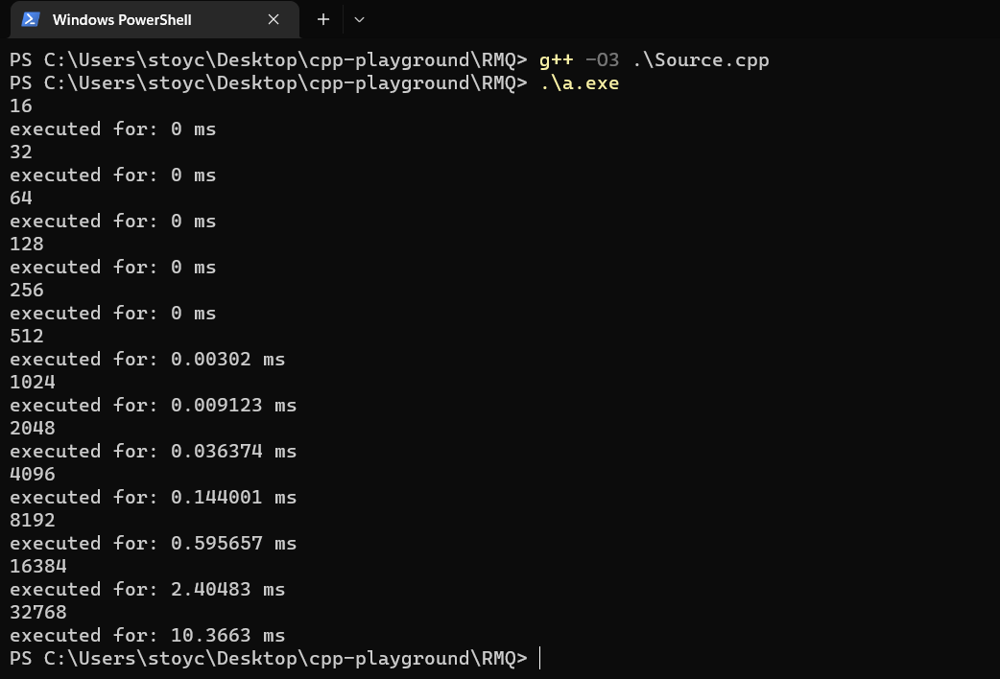

# Range minimum query

**Problem**: We want smallest element in given range in O(1) time and O(n) memory.

Learn more about the problem here:
https://www.youtube.com/watch?v=0rCFkuQS968

**Compile & run tests:** 

In the example we use GCC compiler, even though MSVC compiler results in release mode are't so different.
We have 8 GB of RAM and run on intel CORE i5 10th gen.

